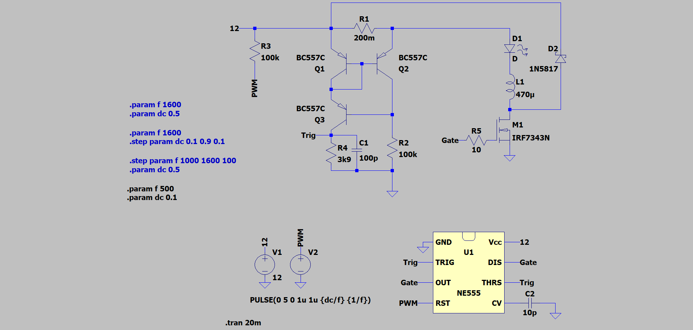

Hardware
========

This light sculpture includes 15 power LEDs. Each power LED has its own `current source`_.

.. _current source: http://led-treiber.de/html/getaktete_treiber.html#Treiber-555-MOSFET

Each current source contains a NE555 working as a two-level controller. The average value
of the current is 300 mA. The pin 4 of a NE555 is a reset pin, which can be used for
intensity control via PWM. The next photo shows the LTspice model, which is available in the repository.

To control all 14 current sources the `Adafruit PCA9685 16-Channel Servo Driver`_,
based on the IC PCA9685_, is used.

This IC is controlled by an `Arduino Uno`_. This board is based on the ATmega328P_.

.. _PCA9685: https://www.nxp.com/products/power-management/lighting-driver-and-controller-ics/ic-led-controllers/16-channel-12-bit-pwm-fm-plus-ic-bus-led-controller:PCA9685

.. _Adafruit PCA9685 16-Channel Servo Driver: https://learn.adafruit.com/16-channel-pwm-servo-driver?view=all

.. _Arduino Uno: https://www.arduino.cc/en/Main/arduinoBoardUno&gt;

.. _ATmega328P: https://www.microchip.com/wwwproducts/en/ATmega328P
