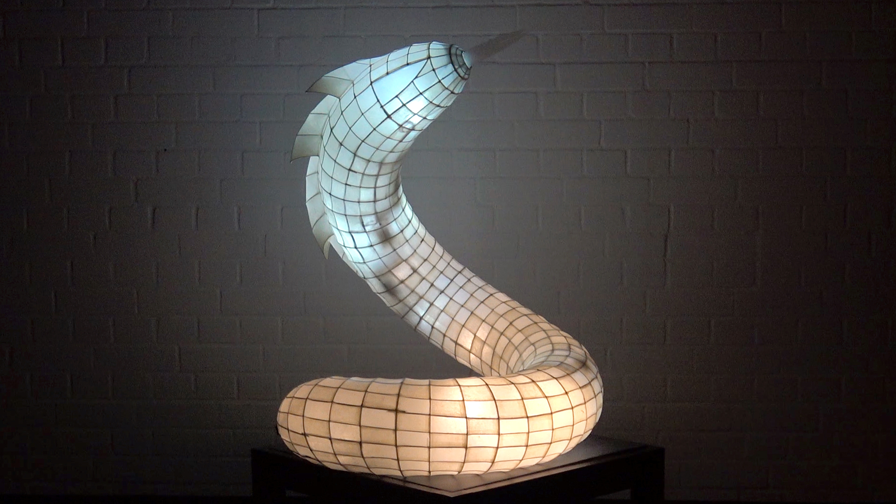

Introduction
============

This light sculpture was build in 2013/2014. It is the one of the first LED projects
from Klingdesign_.

.. _Klingdesign: http://klingdesign.de/

Klingdesign is the light artist Christiane Kling. She produces tailor made light sculptures.
Since 2013 the electronic engineer Günther Beulen has been joining Klingdesing.
He develops Hard- and Software. And this is their first big project:

To see the light snake in action, here is the Youtube video_.

.. _video: https://www.youtube.com/watch?v=SOMzYjLtzh4
